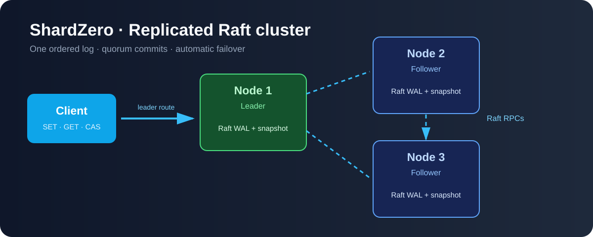
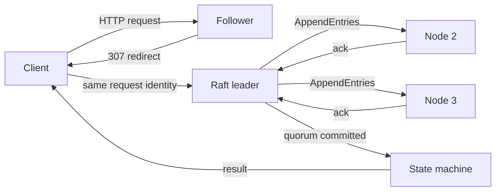
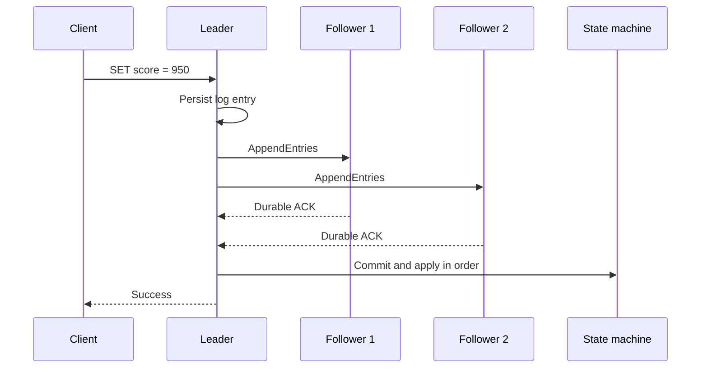

# ShardZero

> A fault-tolerant distributed key-value store built in Go with Raft consensus.



ShardZero keeps one consistent, ordered history of key-value operations across
independent nodes. If the leader fails, the remaining majority elects a new
leader and continues without losing committed data.

## Why ShardZero?

A single-node database becomes unavailable when its machine fails. ShardZero
replicates a durable Raft log to a majority before confirming a write. It is a
distributed-systems learning project focused on consistency, failover, recovery,
and fault testing.

## Features

- Raft leader election, heartbeats, persisted votes, and log repair
- Quorum-based commits and linearizable GET barriers
- CRC-protected WAL, crash recovery, snapshots, and log compaction
- Idempotent request retries through `clientId` and `requestId`
- Deterministic simulation of crashes, restarts, partitions, delay, loss, and disk faults
- React dashboard and local chaos lab
- Docker Compose stack with three independent persistent nodes

## Architecture



Each node owns a private Raft WAL and snapshot. Nodes replicate the same
committed history; ShardZero does not shard data yet.

### Write flow



## Quick start

### Requirements

- Go 1.27+
- Node.js 24+ and npm for the dashboard
- Docker Desktop for the Docker demo

### Run a local three-node cluster

```powershell
go run ./cmd/cluster
```

Wait about one second for an election. In another terminal:

```powershell
go run ./cmd/client --server=http://127.0.0.1:7001 SET score 950
go run ./cmd/client --server=http://127.0.0.1:7002 GET score
go run ./cmd/client --server=http://127.0.0.1:7003 CAS score 950 1000
go run ./cmd/client --server=http://127.0.0.1:7001 STATUS
```

### Docker demo

```powershell
docker compose up --build
```

This starts three nodes on `127.0.0.1:7001` through `:7003`, each with a
persistent Docker volume. Stop the current leader to demonstrate failover:

```powershell
docker stop shardzero-node-2-1
```

The remaining quorum elects a leader. Restart the stopped node and confirm it
catches up:

```powershell
docker start shardzero-node-2-1
go run ./cmd/client --server=http://127.0.0.1:7002 GET score
```

Stop containers while retaining their data:

```powershell
docker compose down
```

Do not use `docker compose down -v` unless you intend to delete the volumes.

### Dashboard and chaos lab

```powershell
go run ./cmd/lab
```

Open [http://127.0.0.1:9100](http://127.0.0.1:9100). The dashboard provides
live node state, a command console, log inspection, and controls to crash,
restart, pause, partition, delay, drop, and heal nodes.

## Failure behavior

| Situation | Result |
| --- | --- |
| Leader crashes in a 3-node cluster | The remaining 2 nodes elect a new leader. |
| One follower crashes | The leader still has a 2/3 quorum and can commit. |
| Two nodes crash | The remaining node waits; it cannot safely commit alone. |
| Network partition | Only the side containing a majority can commit. |
| Restarted node | Restores WAL/snapshot, then catches up from the leader. |
| Entry reaches fewer than a majority | It is uncommitted and can be replaced during repair. |

## Durability and snapshots

Raft state changes are written to a length-prefixed, CRC-protected WAL and
synced before the node relies on them. On restart, a node restores its term,
vote, commit index, log, snapshot, key-value state, and request-result cache.

A snapshot is a saved data file, not an image. It captures the state machine at
a committed log index, allowing old log entries to be compacted and avoiding a
full historical replay on restart. ShardZero compacts only prefixes that every
configured static member has replicated.

## API

| Operation | Method and endpoint |
| --- | --- |
| Set | `PUT /v1/kv/{key}` |
| Get | `GET /v1/kv/{key}` |
| Delete | `DELETE /v1/kv/{key}` |
| Compare-and-set | `POST /v1/kv/{key}/cas` |
| Node status | `GET /v1/status` |
| Liveness | `GET /health` |

Example write body:

```json
{"clientId":"demo","requestId":1,"value":"950"}
```

Retry an uncertain write with the same client ID, request ID, command, and
values. The replicated request cache prevents it from applying twice.

## Testing

```powershell
go test ./...
go vet ./...
go build ./cmd/node ./cmd/client ./cmd/cluster ./cmd/simulator ./cmd/lab
```

Run a deterministic fault scenario:

```powershell
go run ./cmd/simulator --seed=728391 --nodes=3 --operations=80
```

Run the benchmark and seeded release campaign:

```powershell
go test -run '^$' -bench BenchmarkReplicatedWrite -benchmem ./internal/raft
powershell -ExecutionPolicy Bypass -File scripts/phase9-release.ps1 -Seeds 10000 -Operations 80
```

The simulator verifies leader uniqueness, one vote per term, log matching,
committed-prefix preservation, ordered application, acknowledgement after
commit, and final convergence.

## Project structure

```text
cmd/node/          Node HTTP server
cmd/client/        CLI with retry identity
cmd/cluster/       Local multi-process launcher
cmd/simulator/     Deterministic fault simulation and replay
cmd/lab/           Dashboard and chaos-lab launcher
dashboard/         React dashboard
internal/raft/     Election, replication, commit, snapshots, recovery
internal/storage/  CRC-protected WAL and file locking
internal/cluster/  Leader discovery and client retries
internal/lab/      Local fault controller and peer proxies
scripts/           Validation scripts
```

## Limits

ShardZero is a learning project, not a production service. It has static
membership, no authentication, no TLS, no follower reads, no dynamic membership,
and no cross-membership snapshot transfer. Keep it on trusted local networks.

## License

Built as a distributed-systems learning project by Rushabh Dave.
